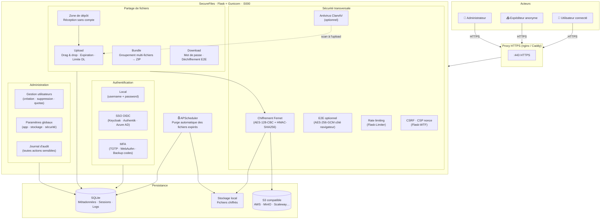

# SecureFiles

**Alternative self-hostée à WeTransfer.** Partagez des fichiers de façon éphémère, chiffrée et maîtrisée — sans dépendre d'un tiers.

---

## Pourquoi SecureFiles ?

Les services de partage grand public (WeTransfer, Smash, Filemail…) traitent vos fichiers sur leurs infrastructures. SecureFiles vous rend le contrôle : vous choisissez le serveur, les règles d'accès et la durée de vie des données.

- **Vos données restent chez vous** — aucun tiers n'a accès à vos fichiers
- **Chiffrement au repos** — les fichiers sont chiffrés sur le disque (Fernet : AES-128-CBC + HMAC-SHA256)
- **Chiffrement de bout en bout (E2E)** — en mode E2E, le fichier est chiffré côté navigateur (AES-256-GCM) avant envoi ; le serveur ne voit jamais le contenu en clair
- **Éphémère par nature** — expiration automatique, suppression après téléchargement
- **Déploiement simple** — un `docker compose up` suffit

---

## Architecture



---

## Fonctionnalités

### Partage de fichiers

| Fonctionnalité | Détail |
|---|---|
| Drag & drop | Dépôt par glisser-lâcher ou clic |
| Lien unique | Identifiant UUID non devinable, non listé |
| Expiration | 3 h · 1 j · 1 sem · 1 mois — ou valeur par défaut admin |
| Limite de téléchargements | 1 · 5 · 10 · illimité |
| Protection par mot de passe | Accès conditionné à un mot de passe |
| Autodestruction | Suppression dès le premier téléchargement |
| Bundle | Regrouper plusieurs fichiers sous un seul lien, téléchargeable en ZIP |
| Zone de dépôt | Recevez des fichiers sans que l'expéditeur ait un compte |
| Antivirus | Scan ClamAV optionnel à l'upload |

### Chiffrement

| Mode | Détail |
|---|---|
| Repos | Fernet (AES-128-CBC + HMAC-SHA256) — chiffrement serveur systématique |
| E2E optionnel | AES-256-GCM dans le navigateur — le serveur ne voit jamais le clair |
| E2E obligatoire | Mode admin pour forcer l'E2E sur toute l'instance |

### Authentification & Comptes

| Fonctionnalité | Détail |
|---|---|
| SSO OIDC | Connexion via votre fournisseur d'identité (Keycloak, Authentik, Azure AD…) |
| MFA TOTP | Google Authenticator, Authy ou compatible RFC 6238 |
| MFA WebAuthn | Clé matérielle (YubiKey), Touch ID, Windows Hello |
| Codes de récupération | Codes de secours en cas de perte du second facteur |
| Verrouillage de compte | Blocage temporaire après tentatives échouées |
| Thème clair / sombre | Préférence persistée par compte |
| Langue | Français / English — sélectable dans le profil |
| Export RGPD | Téléchargement de toutes ses données personnelles (JSON) |

### Stockage

| Backend | Détail |
|---|---|
| Local | Fichiers chiffrés sur le disque du serveur (défaut) |
| S3 compatible | AWS S3, MinIO, Scaleway Object Storage, etc. |

### Administration

| Fonctionnalité | Détail |
|---|---|
| Panel d'administration | Gestion centralisée depuis `/admin` |
| Gestion des utilisateurs | Création, suppression, promotion admin, réinitialisation mot de passe |
| Quotas | Limite de stockage et de fichiers par compte |
| Extensions bloquées | Liste configurable (exe, bat, sh…) |
| Inscriptions publiques | Activation / désactivation |
| Journal d'audit | Traçabilité de toutes les actions sensibles (IP anonymisées) |
| Mode maintenance | Page de maintenance avec message personnalisable |
| Nettoyage automatique | Purge planifiée des fichiers expirés (APScheduler) |
| Mentions légales & CGU | Édition Markdown depuis le panel |
| Couleur d'accentuation | Personnalisation de la charte graphique |

---

## Déploiement

### Prérequis

- [Docker](https://docs.docker.com/get-docker/) ≥ 20
- [Docker Compose](https://docs.docker.com/compose/) ≥ 2

### Démarrage rapide

```bash
git clone <url-du-dépôt> && cd securefiles
cp .env.example .env
```

Éditez `.env` et renseignez au minimum :

```env
# Générer avec : python -c "import secrets; print(secrets.token_hex(32))"
SECRET_KEY=<clé aléatoire>

# Générer avec : python -c "from cryptography.fernet import Fernet; print(Fernet.generate_key().decode())"
ENCRYPTION_KEY=<clé Fernet>
```

Puis :

```bash
docker compose up -d --build
```

L'application écoute sur `http://127.0.0.1:5000`. Placez un proxy HTTPS (nginx, Caddy…) devant.

### Variables d'environnement

| Variable | Description |
|---|---|
| `SECRET_KEY` | Clé secrète Flask — **obligatoire** |
| `ENCRYPTION_KEY` | Clé Fernet pour le chiffrement des fichiers — **obligatoire** |
| `WEBAUTHN_RP_ID` | Domaine de l'app (ex. `share.example.com`) — requis si WebAuthn |
| `WEBAUTHN_RP_ORIGIN` | Origine complète (ex. `https://share.example.com`) — requis si WebAuthn |
| `SSO_CLIENT_ID` | Client ID OIDC |
| `SSO_CLIENT_SECRET` | Secret OIDC |
| `SSO_DISCOVERY_URL` | URL de découverte OIDC (`.well-known/openid-configuration`) |
| `CLAMAV_HOST` | Hôte du démon ClamAV (ex. `clamav`) |
| `CLAMAV_PORT` | Port ClamAV (défaut : `3310`) |
| `MAX_FILE_SIZE` | Taille max de fichier en Mo (défaut configurable en admin) |

### Proxy HTTPS (exemple nginx)

```nginx
location / {
    proxy_pass http://127.0.0.1:5000;
    proxy_set_header X-Forwarded-For   $proxy_add_x_forwarded_for;
    proxy_set_header X-Forwarded-Proto $scheme;
    proxy_set_header X-Forwarded-Host  $host;
    proxy_set_header Host              $host;
    client_max_body_size 10g;
}
```

### ClamAV (antivirus optionnel)

Décommentez le service `clamav` dans `docker-compose.yml` et ajoutez dans `.env` :

```env
CLAMAV_HOST=clamav
CLAMAV_PORT=3310
```

---

## Stack

| Composant | Technologie |
|---|---|
| Backend | Python 3.11 · Flask 3 · Gunicorn |
| Base de données | SQLite (WAL mode) |
| Chiffrement | cryptography (Fernet) · AES-256-GCM (navigateur) |
| Auth | Flask-Login · pyotp · webauthn · Authlib (OIDC) |
| Frontend | Bootstrap 5 · Tailwind CSS · FontAwesome |
| i18n | Flask-Babel (FR / EN) |
| Planificateur | APScheduler |
| Conteneurisation | Docker · Docker Compose |
| Stockage objet | boto3 (S3 compatible) |
| Antivirus | pyclamd (ClamAV) |

---

## Licence

MIT
